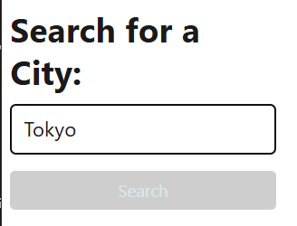
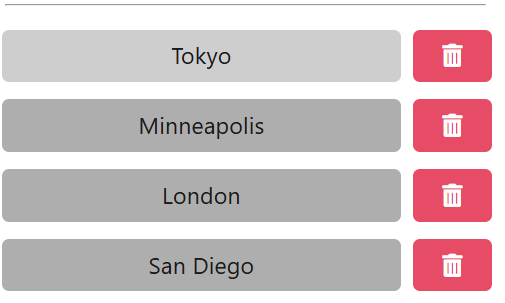
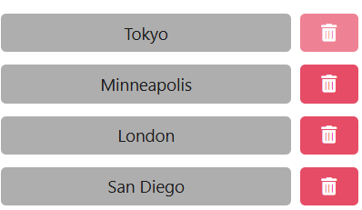

# Forecast App

## Description:
Web service that uses the OpenWeather API to get a city's current weather and 5-day forecast.

This exercise allowed me to practice with building an application's back-end, with connecting that back-end to the application's front-end, with calling an external API, and with deploying a site using Render.

## Table of Contents:
- [Technologies](#technologies)
- [Installation](#installation)
- [Usage](#usage)
- [License](#license)
- [Questions](#questions)

## Technologies:
- TypeScript
- Node.js
- Express.js
- [OpenWeather API](https://openweathermap.org/api)
- [Render](https://render.com/)

## Installation:
View the deployed application at <https://forecast-app-zpli.onrender.com/>.

## Usage:
- To view a city's current weather and forecast, type that city's name into the search bar. Then, click 'Search'.  

- Click on a city in the search history list to re-load the weather for that location.  

- Click the delete icon to remove a city from the search history.  

## License:
This application is covered under the [ISC](https://opensource.org/licenses/ISC) license.

## Questions:
Contact me via github: [kayla-e774](https://github.com/kayla-e774)  
Or email me at: <kengelstad16@gmail.com>